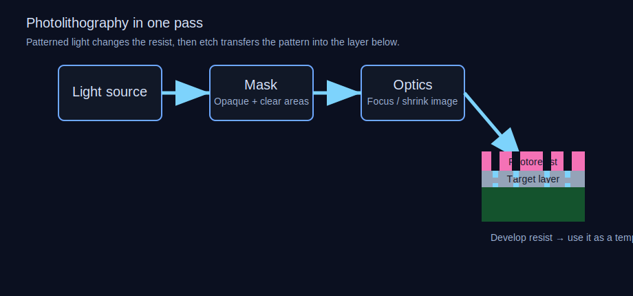

# Day 3: Photolithography 101
## Printing Circuits with Light — How We Paint at the Atomic Scale

Yesterday, we ended with a pristine silicon wafer — 300mm of eleven-nines-pure crystal, polished to half a nanometer of flatness. A perfect blank canvas. Today, we learn how the semiconductor industry paints on it. And the brush is light itself.

Photolithography is the single most critical step in chip manufacturing. It's also the most repeated: a modern processor goes through **60 to 80 separate lithography passes** during its fabrication, each one printing a different layer of the chip's 3D structure. If wafer-making is the foundation and transistor design is the blueprint, lithography is the construction crew that actually builds the building — one impossibly thin floor at a time.

The basic concept sounds almost absurdly simple. Coat the wafer with a light-sensitive chemical. Shine patterned light onto it. Develop the chemical, like developing a photograph. Use the resulting pattern as a stencil to etch or deposit material. Wash off the stencil. Repeat.

It sounds like silk-screening a t-shirt. But here's what makes it the most extraordinary optical engineering challenge humans have ever tackled: you're printing features that are **smaller than the wavelength of the light you're using to print them**. Today's leading-edge fabs routinely print structures 3–5 nanometers wide using light with a wavelength of 13.5 nanometers — which itself replaced 193-nanometer light that was used to print 7nm features. That's like painting a portrait using a brush five times wider than the finest detail you need to capture.

How is that even possible? That's what this lesson is about.

---

## The Photoresist: A Chemical That Remembers Light

Every lithography step begins the same way: a robotic arm spins the wafer at **1,500–4,000 RPM** while a nozzle dispenses a small puddle of **photoresist** — a liquid polymer dissolved in a solvent that's sensitive to specific wavelengths of light. Centrifugal force spreads the resist into an astonishingly uniform film, typically **50–500 nanometers thick** depending on the application. The uniformity target? Thickness variation of less than **1 nanometer** across the entire 300mm wafer. Imagine painting a wall the size of a football field and keeping the paint thickness consistent to within the width of a single molecule.

The resist is then "soft-baked" on a hot plate at **90–110°C** for 60–90 seconds to drive off the solvent and harden the film into a stable solid.

Photoresists come in two flavors:

- **Positive resist:** Where light hits, the polymer chains break apart and become soluble in developer solution. The exposed areas wash away. You keep what was in the dark.
- **Negative resist:** Where light hits, the polymer cross-links and hardens. The unexposed areas wash away. You keep what was in the light.

Modern leading-edge lithography overwhelmingly uses **positive resist** because it produces sharper edges. Specifically, the industry standard since the mid-1990s has been **chemically amplified resists (CARs)**, invented by Hiroshi Ito, C. Grant Willson, and Jean Fréchet at IBM in 1982. The clever trick: the light doesn't directly break the polymer. Instead, it generates an acid molecule. During a post-exposure bake at **100–130°C**, each acid molecule catalyzes a chain reaction that deprotects dozens of nearby polymer molecules, making them soluble. One photon's worth of acid does the work of many. This chemical amplification is what made it possible to use less light and still get a strong pattern — critical as the industry pushed to shorter wavelengths where photon sources are dimmer.

For EUV lithography (which we'll cover in depth on Day 8), the story gets even more exotic. EUV photons at 13.5nm carry **92 electron-volts** of energy each — enough to blast electrons out of atoms. These secondary electrons, not the photons themselves, do most of the actual resist chemistry. The resist becomes a chaotic cascade of ionization events, and controlling that chaos to produce clean, sharp patterns at 3nm resolution is one of the hardest unsolved problems in materials science. Companies like **Inpria** (acquired by JSR in 2021) are developing entirely new metal-oxide resists for EUV that absorb photons more efficiently than traditional organic polymers.

---

## The Mask: A $10 Million Stencil

Before light reaches the wafer, it passes through a **photomask** (or reticle) — a fused silica plate, about 152mm × 152mm × 6.35mm, with the circuit pattern etched into an ultra-thin layer of chrome on its surface. Think of it as a glass slide with an absurdly intricate stencil.

Here's a number that should make you blink: a single leading-edge EUV photomask costs **$300,000 to $1,000,000** to produce. A complete mask set for a modern chip — one mask per lithography layer, 60–80 layers — runs **$10–15 million**. Before you've fabricated a single chip, you've spent more on masks than most companies spend on an entire product line. This is one of the key reasons why cutting-edge chip design is a billionaires-only club.

Masks are manufactured by specialist companies — **Photronics** (US) and **Toppan** (Japan) dominate the merchant market, while TSMC, Samsung, and Intel make their most advanced masks in-house. The process uses **electron beam lithography** — no light involved. An extremely focused beam of electrons scans across the chrome-coated quartz plate, writing the pattern dot by dot. A single advanced mask can take **20–40 hours** of continuous e-beam writing time because the pattern is so dense and complex.

But here's the counterintuitive part: the mask pattern doesn't look like the circuit it prints. Not even close.

---

## Optical Proximity Correction: Lying to the Light

If you simply put the desired circuit pattern on a mask and projected it onto the wafer, the result would be a blurry mess. Light diffracts — it bends around edges, bleeds into dark areas, and interferes with itself. A pattern of perfectly square corners on the mask would print as sad, rounded blobs on the wafer. Narrow lines would print thinner than intended or vanish entirely. Dense arrays of lines would print differently from isolated lines at the same width.

The solution is one of the most intellectually audacious ideas in the field: **Optical Proximity Correction (OPC)**. Instead of putting the "true" pattern on the mask, you put a *deliberately distorted* pattern that, after all the optical distortions of projection, produces the shape you actually want on the wafer.

Imagine you need to print a perfect square. You know the optical system will round the corners. So you add tiny "serifs" — aggressive protrusions at each corner of the mask pattern — that get smoothed down by diffraction into something closer to a right angle. Need to print a narrow line next to a wider space? You make the line on the mask slightly wider to compensate for how the optics will thin it out.

OPC is computed using massive simulations. Companies like **Synopsys**, **Cadence**, and **Siemens EDA** (formerly Mentor Graphics) sell software that models the full physics of light propagation through the optical system, resist chemistry, and etching behavior. A single OPC run for one mask layer can consume **tens of thousands of CPU-hours** and take days on a cluster. The resulting mask patterns look nothing like circuits — they look like deranged abstract art, with hammer-head serifs, sub-resolution assist features (tiny shapes too small to print but which improve the pattern fidelity of nearby features through constructive interference), and bizarre fractal-like decorations that exist only to trick the light into doing the right thing.

This is a staggering inversion: we're not designing the mask to show the light what we want. We're designing the mask to *lie to the light* in precisely the right way so that the light's own distortions produce the truth.

---

## The Scanner: A $350 Million Camera Running Backward

Now for the machine that ties it all together: the **lithography scanner**, built almost exclusively by one company on Earth — **ASML**, headquartered in Veldhoven, the Netherlands. (We'll dive deep into ASML's EUV machines on Day 8. Today, let's understand the fundamental optics.)

A lithography scanner is, at its core, a projection camera running in reverse. Instead of capturing light from the world to record an image, it projects light *through* a mask *onto* the wafer to create an image. But every parameter of this "camera" is pushed to the bleeding edge of physics.

**The light source.** For most of the industry's history (1990s through ~2019), the workhorse wavelength has been **193 nanometers** — deep ultraviolet (DUV) light produced by an **argon fluoride (ArF) excimer laser**. These lasers work by electrically exciting a mixture of argon and fluorine gases, which briefly form ArF molecules that emit UV light when they dissipate. A modern ArF laser fires **6,000 pulses per second**, each pulse lasting about **20 nanoseconds**, delivering roughly **90 watts** of average UV power. The laser itself is about the size of a large refrigerator and costs several million dollars.

For the latest nodes, **EUV lithography** uses 13.5nm light — not even ultraviolet but soft X-rays. We'll defer the full EUV story to Day 8, but know this: there is no laser that naturally emits 13.5nm light. You have to create it by firing a CO₂ laser at **50,000 tiny droplets of molten tin per second**, each droplet 25 micrometers wide, generating a plasma at roughly **500,000°C**. It's absurd, and it works.

**The optics.** The light from the source passes through (DUV) or reflects off (EUV) a series of precision lenses or mirrors that reduce the mask pattern by **4× or 5×** before it hits the wafer. A DUV scanner contains **30–40 individual lens elements** made of ultra-pure fused silica and calcium fluoride, each polished to sub-nanometer accuracy. The total optical column weighs several tons and costs more than many houses. These lenses are made primarily by **Carl Zeiss SMT** in Oberkochen, Germany — the only company in the world capable of producing them at the required quality.

The 4× reduction is a crucial design choice. It means the mask pattern is four times larger than what prints on the wafer, which relaxes the tolerances on mask manufacturing. A 20nm feature on the wafer only needs to be 80nm on the mask — still difficult, but manageable with e-beam writing.

**The stage.** The wafer sits on a stage that moves with **sub-nanometer precision** at speeds up to **700 mm/s**. During exposure, the mask and wafer move simultaneously in opposite directions (the mask at 4× the wafer speed, matching the reduction ratio). This scanning motion is why the tool is called a "scanner" rather than a "stepper" (older machines that exposed the full field at once without scanning). The stage uses magnetic levitation — the wafer chuck literally floats on magnetic fields — to eliminate vibration. Position is tracked by **laser interferometers** measuring to fractions of a nanometer. The entire machine weighs about **180 tons** and sits on active vibration isolation systems that can compensate for disturbances as subtle as someone walking in the hallway outside the fab.

---

## Immersion Lithography: Water Makes Light Bend Harder

By the early 2000s, the industry faced a crisis. The minimum feature size you can print with light is governed by the **Rayleigh criterion**:

> **Resolution = k₁ × λ / NA**

Where **λ** is the wavelength, **NA** is the numerical aperture of the lens (how much light it collects), and **k₁** is a process factor that can't go below about 0.25. With 193nm light and a numerical aperture of about 0.85 (limited by how sharply you can bend light through air), the finest printable half-pitch was around 65nm. Moore's Law demanded 45nm, then 32nm. The industry needed a new trick.

In 2002, **Burn Lin** of TSMC proposed a solution that had been discussed in academic circles but was considered impractical: fill the gap between the final lens element and the wafer with **ultra-pure water** instead of air.

The insight was elegant. Water has a refractive index of about **1.44** at 193nm (compared to 1.0 for air). Since numerical aperture equals *n* × sin(θ), where *n* is the refractive index of the medium, replacing air with water immediately boosted the maximum NA from ~0.93 to about **1.35**. That's a 45% improvement in resolution — for free, in a sense, by just adding water.

But "just adding water" to a system operating at nanometer precision, moving at 700 mm/s, while maintaining uniform 193nm UV light intensity across the exposure field — that's an engineering nightmare. How do you keep bubbles out? (A single 50-micron air bubble in the water film ruins the exposure.) How do you prevent the water from leaking across the wafer? (The answer: a precisely engineered meniscus held in place by surface tension and a carefully controlled "shower head" nozzle system.) How do you keep the water clean? (You filter it to insane standards and flow it constantly.)

ASML's first immersion scanner, the **TWINSCAN XT:1700i**, shipped in 2006. By 2008, immersion lithography was mainstream. The current DUV workhorse, ASML's **TWINSCAN NXT:2050**, achieves an NA of 1.35 and can print features down to about **38nm half-pitch**. These machines cost approximately **$100 million each** and can expose **275 wafers per hour** — that's one wafer every 13 seconds, each containing hundreds of chips with billions of transistors.

---

## Multi-Patterning: When One Exposure Isn't Enough

Even immersion DUV at 1.35 NA can only directly print features down to about 38nm half-pitch. But leading-edge chips before EUV arrived needed **14nm and even 7nm** features. How?

The answer is **multi-patterning** — printing the same layer multiple times with different masks, each mask containing only a subset of the features, so no individual exposure needs to resolve features too close together. 

The simplest version, **LELE (Litho-Etch-Litho-Etch)**, prints half the features, etches them, then prints the other half in between. More advanced schemes like **SADP (Self-Aligned Double Patterning)** and **SAQP (Self-Aligned Quadruple Patterning)** use the physics of thin-film deposition to automatically create features at half or quarter the pitch of the original lithographic pattern.

SAQP is the wildest: you print a line, deposit a thin "spacer" film conformally around it, etch away the original line, then use the two remaining spacer sidewalls as your actual features. Repeat the process and you've quadrupled the pattern density. Samsung and TSMC used SAQP extensively at 7nm and 5nm nodes with DUV lithography.

The cost? Multi-patterning doubles or quadruples the number of expensive lithography steps. A layer that once needed a single exposure might now need four, each with its own mask, its own resist coat, its own etch step. This is a major reason EUV was so desperately needed — a single EUV exposure can replace **3–5 DUV multi-patterning steps**, reducing cost and, crucially, reducing the overlay errors that accumulate when you stack multiple patterns on top of each other.

---

## Overlay: The Alignment Challenge

Speaking of stacking patterns — every lithography exposure after the first must align perfectly to the layers already on the wafer. This alignment, called **overlay**, must be accurate to about **1.5 nanometers** on current nodes. That's roughly **7 silicon atoms.**

Think about what this means. You have a 300mm wafer that's been through dozens of processing steps involving temperatures from room temperature to over 1,000°C. The wafer has expanded, contracted, warped slightly from film stress, and been handled by dozens of robotic arms. And now you need to place the next layer's pattern within 1.5nm of where it should be relative to the previous layer — across the entire 300mm surface.

The scanner achieves this by reading **alignment marks** — small target patterns etched into the wafer's surface during earlier processing steps. Multiple alignment marks are distributed across the wafer, and the scanner's sensors locate them with sub-nanometer precision using diffraction-based measurement. The scanner's software then computes a mathematical model of how the wafer has distorted (translation, rotation, expansion, and higher-order warping terms) and adjusts the stage position and optical field correction in real-time during exposure.

ASML's latest scanners measure up to **40 alignment marks per wafer** and use machine-learning-enhanced models to predict and correct for systematic distortion patterns. Even with all this, overlay is the **tightest specification in the entire fab** and one of the top three yield limiters for advanced chips.

---

## Developing and Beyond: Completing the Pattern

After exposure, the wafer goes through **post-exposure bake (PEB)** — critical for chemically amplified resists, as this is when the acid-catalyzed deprotection reaction actually happens. Temperature uniformity during PEB must be controlled to **±0.1°C** because the reaction rate is exponentially sensitive to temperature. A mere 1°C variation can shift feature dimensions by 10%.

Then comes **development**: the wafer is immersed in (or more precisely, puddle-developed with) a mild base solution — typically **tetramethylammonium hydroxide (TMAH)** at 2.38% concentration, a recipe so standard it's been the same since the 1980s. The exposed positive resist dissolves. What remains is a precisely patterned stencil of hardened polymer, typically 50–200nm tall, covering exactly the areas where you want to protect the underlying silicon (or metal, or oxide) from the next processing step — etching.

And that's where tomorrow's lesson picks up. In **Day 4**, we'll explore **Moore's Law** — the audacious 60-year prediction that the number of transistors on a chip would double roughly every two years, and why that relentless march depends entirely on making lithography do things that seem physically impossible. We've already seen the tricks: immersion, multi-patterning, OPC. But the story of *why* the industry kept pushing — the economics, the competition, and the looming walls that threaten to end the scaling party — is even more fascinating than the physics.

For now, marvel at this: the global semiconductor industry produces roughly **2 trillion square centimeters** of patterned silicon per year, with every square centimeter exposed by light pushed through optics more precise than the Hubble Space Telescope, aligned to the width of a few atoms, at the rate of one wafer every 13 seconds per machine. The machines to do this cost more than a Boeing 787 Dreamliner. The masks cost more than a house. The chemicals are controlled to parts per trillion. And it all started with the same basic idea as a 19th-century darkroom photograph: shine light on a chemical, and watch what develops.

---

{{#quiz quizzes/day-03.toml}}
