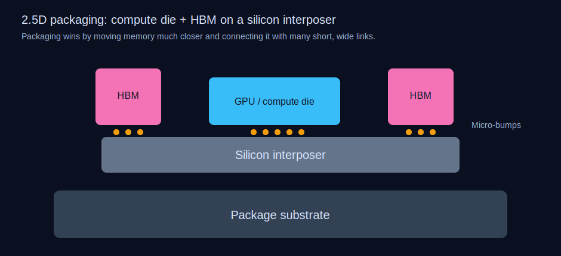

# Day 13: Packaging
## Chiplets, 3D Stacking, and Why the Package Is the New Bottleneck

For twelve days we've been obsessing over what happens *on* the silicon — transistors, wiring, polishing, lithography. We've followed a chip from raw sand to a finished die sitting on a 300 mm wafer, a pristine rectangle of circuitry containing billions of transistors connected by kilometers of copper. And now comes the part that the semiconductor industry ignored for fifty years and is suddenly scrambling to reinvent: getting that die into a form factor that can actually talk to the outside world.

**Packaging** — the process of encapsulating a bare silicon die, connecting it to power and data, and making it survive in the harsh reality of a circuit board — used to be the boring epilogue of chip manufacturing. Take die, glue to leadframe, attach wires, encase in black epoxy resin, ship. For decades, packaging was a cost center, not an innovation frontier. A $20 billion fab and a $380 million EUV scanner produced the die; a $2 million wire bonder finished the job.

That era is over. Today, advanced packaging is the single most important bottleneck in the semiconductor industry. It's the reason NVIDIA can't make enough AI GPUs. It's why AMD's server chips outperform Intel's. It's the technology that makes Apple's M-series laptop chips possible. And it's where some of the most creative engineering in the entire field is happening right now.

---

## The tyranny of the package

Why does packaging matter so much? Because the best die in the world is useless if you can't get data and power into it fast enough.

Consider NVIDIA's H100 GPU, the chip that powered the first wave of the generative AI boom. The die itself contains 80 billion transistors, but its performance is fundamentally limited by **memory bandwidth** — how fast it can shovel data from HBM (High Bandwidth Memory) stacks into its compute cores. The H100 achieves **3.35 terabytes per second** of memory bandwidth. That's roughly equivalent to downloading the entire Library of Congress every second. And it's still not enough — the compute units spend significant time idle, starved for data.

Every one of those 3.35 TB/s flows through the **package** — the substrate and interconnects that physically link the GPU die to its six HBM3 memory stacks. The wires inside the package are wider and slower than on-die interconnects, and they consume more energy per bit. At the system level, something like **30-40% of total power** in a modern data center chip goes to moving data, not computing with it. The package is where most of that power is burned.

This is the fundamental tension: transistors keep shrinking (making computation cheaper), but the connections between chips, and between chips and memory, are *not* shrinking at the same rate. The gap between compute capability and communication capability widens every generation. Packaging is the field trying to close that gap.

---

## A brief history of packages

The earliest integrated circuits of the 1960s were packaged in ceramic **DIP** (Dual In-line Package) housings — rectangular blocks with two rows of metal legs that plugged into a circuit board. A DIP-40 had 40 pins and could carry enough signals for a 16-bit microprocessor. Simple, robust, and limited.

As chips grew more complex, they needed more I/O connections. The industry moved through **QFP** (Quad Flat Package) with leads on all four sides — Intel's 486 in 1989 used a 168-pin PGA (Pin Grid Array) — and eventually to **BGA** (Ball Grid Array) in the mid-1990s. Instead of pins sticking out from the sides, BGAs placed an array of solder balls on the bottom of the package, exploiting the full underside area. A modern BGA can accommodate **thousands** of connections: Apple's M2 Ultra, for instance, has roughly 6,700 signal and power balls on its package substrate.

But more pins alone wasn't enough. What mattered was **bandwidth density** — how many high-speed signals you could squeeze through a given area. A traditional BGA has solder balls on a **0.4-1.0 mm pitch** (center-to-center spacing). That's enormous compared to on-chip wiring, where metal lines are spaced 20-30 nanometers apart. There's roughly a **10,000× gap** between on-chip wire density and package-level interconnect density. Bridging that gap is the central challenge of advanced packaging.

---

## Flip-chip: turning things upside down

The first major packaging innovation was **flip-chip**, pioneered by IBM in the 1960s under the name "C4" (Controlled Collapse Chip Connection). Instead of using thin gold wires to connect pads on the die's top surface to the package frame — the traditional **wire bonding** approach — you flip the die upside down and directly solder it to the package substrate through an array of tiny bumps.

Wire bonding is limited. Each bond is made sequentially (one wire at a time), the wires have inductance and resistance, and you can only bond around the **periphery** of the die. A large die with a wire-bonded package might have 500-800 connections, all around the edges.

Flip-chip removes these constraints. Solder bumps can be placed across the **entire face** of the die in an area array, giving you thousands of connections. The bumps are shorter than bond wires (50-100 µm tall vs. 1-3 mm for wire loops), reducing parasitic inductance by 10×. The die is also directly on the substrate, improving thermal conduction — the heat generated by the transistors has a shorter path to the heat spreader above.

Today, essentially all high-performance processors use flip-chip packaging. The bumps have been shrinking over time: from 150 µm pitch C4 bumps to **micro-bumps** at 40-55 µm pitch used in advanced 2.5D and 3D stacking. The current frontier is **hybrid bonding** at pitches below 10 µm — but we'll get there.

---

## The chiplet revolution

Here's a surprising fact: **making a single large chip is almost always worse than making several small ones and connecting them in a package.**

This seems counterintuitive. Wouldn't one big chip, with everything on a single piece of silicon, be faster than a bunch of small chips glued together? The answer involves one of the most important concepts in semiconductor economics: **yield**.

Remember from Day 7 that defects randomly distributed across a wafer kill any die they land on. If you're making a small die — say 50 mm² — and the wafer has 0.1 defects per cm², your yield is about 95%. But if you make a die four times larger (200 mm²), the yield doesn't drop to 80% — it drops to approximately **82%** due to the Poisson distribution (and in practice, often worse due to clustering). At 600 mm², which is approaching the **reticle limit** of about 858 mm² (the maximum area a single EUV exposure can print, set by the 26 × 33 mm reticle field), yield plummets to around **55-60%** even in a mature process. Nearly half your chips are defective.

AMD figured this out and made it the cornerstone of their comeback. In 2019, their EPYC "Rome" server processor didn't try to cram 64 CPU cores onto one massive die. Instead, they built **eight identical 74 mm² "chiplets"** (called CCDs — Core Complex Dies), each containing 8 cores, and connected them through a central **I/O die** on a single package. Each CCD was manufactured at TSMC's 7 nm node, while the I/O die — which doesn't need cutting-edge transistors — was built at a cheaper 14 nm GlobalFoundries process.

The advantages were staggering:

- **Yield:** Small 74 mm² chiplets yield far better than a single hypothetical ~500 mm² monolithic die
- **Cost:** The I/O die uses a cheaper node, saving ~50% on that silicon
- **Flexibility:** The same CCD chiplet can be used in 8-core consumer chips (1 chiplet), 16-core workstation chips (2 chiplets), or 64-core server chips (8 chiplets). One design, multiple products.
- **Binning:** If one core on a chiplet is defective, disable it and sell it as a 6-core part. On a monolithic 64-core die, one bad core might waste the entire chip.

Intel eventually followed with its own chiplet approach in Meteor Lake (2023), and Apple's M1 Ultra is literally **two M1 Max dies** connected through a silicon interposer. The chiplet model has won.

But chiplets create a new problem: how do you connect them fast enough?

---

## 2.5D packaging: the silicon interposer

The most established solution is **2.5D packaging** using a **silicon interposer** — an additional thin layer of silicon that sits between the chiplets and the organic package substrate. The interposer doesn't contain transistors; it's just a wiring layer, fabricated using standard semiconductor lithography to achieve much finer interconnect pitches than an organic substrate can manage.

TSMC's **CoWoS** (Chip-on-Wafer-on-Substrate) is the canonical example and the technology behind virtually every major AI accelerator: NVIDIA's A100, H100, H200, and B200; AMD's MI300X; Google's TPU v5. In CoWoS, the GPU die and HBM stacks are placed side by side on a silicon interposer, connected through **micro-bumps** at 40-55 µm pitch and interposer wiring at 0.4-0.8 µm line width.

The numbers are impressive. An H100 CoWoS package has an interposer area of roughly **2,400 mm²** — nearly three times the size of the GPU die itself. The interposer contains multiple redistribution layers (RDLs) with approximately **100,000 interconnects per mm²**, orders of magnitude denser than what an organic substrate can achieve. This density is what enables the 6,144-bit-wide memory bus that delivers those 3.35 TB/s.

But CoWoS has a critical limitation: **cost and capacity**. The silicon interposer itself must be fabricated in a semiconductor fab, consuming wafer starts that could otherwise be used for actual chips. A large interposer requires multiple lithography exposures stitched together (since it exceeds the reticle limit), and it's fragile — a large, thin piece of silicon that can crack during handling. As of 2025, CoWoS capacity has been the single biggest constraint on NVIDIA's GPU supply, more than the GPU wafers themselves. TSMC has been frantically building CoWoS capacity, investing billions to expand from roughly **15,000 wafers per month** in 2023 to an estimated **40,000+ per month** by late 2025.

An alternative to silicon interposers is TSMC's **InFO** (Integrated Fan-Out), which uses a polymer-based redistribution layer instead of silicon. InFO is cheaper and was first deployed in Apple's A10 chip in 2016. However, its interconnect density is lower than CoWoS, making it unsuitable for the extreme bandwidth demands of HBM-equipped AI chips. It's ideal for mobile processors where cost matters more than raw bandwidth.

---

## 3D stacking: going vertical

If 2.5D puts chiplets side by side on an interposer, **3D stacking** goes further by placing dies directly on top of each other. This sounds simple but is enormously challenging — you're bonding two active silicon surfaces together and connecting them through the silicon itself.

The key technology is **TSV** (Through-Silicon Via) — a vertical electrical connection that passes completely through a silicon die. Making a TSV involves drilling a deep, narrow hole through silicon (typically 5-10 µm diameter, 50-100 µm deep — an aspect ratio of 10:1 or more), lining it with insulator, and filling it with copper. A single die might contain thousands of TSVs.

**HBM** (High Bandwidth Memory) is the most commercially successful 3D-stacked product. An HBM3E stack consists of **8 or 12 DRAM dies** stacked on top of a base logic die, connected by over **5,000 TSVs** per die. Each stack is about **720 µm tall** — less than a millimeter — and delivers 819 GB/s of bandwidth through a 1,024-bit-wide interface. For comparison, standard DDR5 memory uses a 64-bit interface. HBM achieves 16× the bus width by going vertical.

SK Hynix dominates HBM production with roughly **50% market share**, followed by Samsung (**~40%**) and Micron (**~10%**). HBM3E commands a significant price premium — roughly **$15-20 per GB** compared to $2-3/GB for standard DDR5 — and demand from AI training has created chronic shortages. SK Hynix reportedly has its entire HBM3E output through 2025 sold out to NVIDIA.

---

## Hybrid bonding: the next frontier

TSV-based 3D stacking uses micro-bumps (solder balls) to connect the stacked dies, and those bumps are now the bottleneck. At 40 µm pitch, you can fit about 625 connections per mm². That's good, but it's nowhere near the on-chip wire density.

**Hybrid bonding** eliminates the solder bumps entirely. Instead, the copper pads on two dies are directly bonded to each other — copper-to-copper and oxide-to-oxide — in a single step at room temperature, followed by an anneal at 200-300°C to strengthen the copper joints. The result is a seamless metal-to-metal connection with no solder, no underfill, and dramatically tighter pitch.

TSMC's **SoIC** (System on Integrated Chips) achieves hybrid bonding at pitches as tight as **9 µm** in production and is targeting **3-5 µm** pitches in the near future. At 9 µm pitch, the connection density is roughly **12,000 per mm²** — about **20× denser** than micro-bump connections. At 3 µm pitch, it would be **110,000 per mm²**, approaching the density of on-chip metal layers.

This is revolutionary. Hybrid bonding effectively makes the boundary between two stacked dies nearly invisible from an electrical standpoint. AMD used it in its **3D V-Cache** technology: the Ryzen 7 5800X3D (2022) stacks a 64 MB SRAM cache chiplet directly on top of the CPU CCD using TSMC's SoIC, tripling the total L3 cache. The stacked cache connects to the CPU through hybrid bonds so dense and low-latency that the CPU treats it as a seamless extension of its own cache — the software can't tell the difference between on-die and stacked cache.

The catch? Hybrid bonding requires **extraordinary surface preparation**. The copper pads and surrounding oxide must be polished to sub-nanometer roughness (recall our CMP discussion yesterday — this is where it becomes critical again), and the wafers must be aligned to within **±200 nm** accuracy. Any particle larger than a few hundred nanometers trapped between the bonding surfaces creates a void that kills connections. This is surface science at its absolute limit.

---

## The substrate crisis

While everyone focuses on exotic silicon interposers and hybrid bonding, there's a quieter crisis in the humblest part of the package: the **organic substrate**.

Every advanced package ultimately sits on an organic substrate — layers of fiberglass-reinforced resin with copper traces, similar to a PCB but manufactured to much tighter tolerances. For an AI GPU package, this substrate might be **100 × 100 mm**, with **20+ layers** of routing at line widths of **8-15 µm** and via diameters of **25-50 µm**.

Three Japanese companies — **Ibiden**, **Shinko Electric** (a Fujitsu subsidiary), and **AT&S** (Austrian, but with production in Japan and Southeast Asia) — dominate the advanced substrate market with a combined share exceeding **70%**. These are not semiconductor fabs; they're PCB manufacturers who have been gradually pushed to semiconductor-like precision. Building a substrate takes **60-90 process steps** and **60-80 days**, with yields that historically have been well below semiconductor standards.

As AI chips grow larger, the substrate must grow too — and larger substrates warp, delaminate, and have lower yields. NVIDIA's B200 package is so large that it has reportedly pushed substrate technology to its limits, with **warpage management** during the 260°C solder reflow process becoming a critical engineering challenge. The substrate flexes as it heats and cools, and if it warps more than **100-150 µm**, the solder connections to the board fail.

Substrate supply has been a persistent bottleneck, with lead times stretching to **40-50 weeks** during peak demand. It's a striking irony: a package substrate that costs maybe **$50-100** can constrain the delivery of a GPU that sells for **$30,000-40,000**.

---

## Thermal management: the third dimension's tax

Stacking dies in 3D creates an inescapable physics problem: **heat has to get out**. A single processor die might dissipate 200-400 watts. Stack two or three active dies, and you have a thermal density nightmare — heat generated by the bottom die has to conduct through the top die to reach the heat sink.

Silicon's thermal conductivity is decent (~150 W/m·K), but it's not a miracle conductor. The bonding interfaces between stacked dies add thermal resistance — each interface contributes roughly **0.1-0.5 K·cm²/W** depending on the bonding quality. For a 3D stack running at high power, the bottom die can be **10-15°C hotter** than the top die, creating a thermal gradient that causes differential expansion and stresses the bonds.

This is why, so far, 3D stacking has been most successful with **memory** (HBM) and **cache** (V-Cache) — relatively low-power-density circuits. Stacking two high-power logic dies (like two CPUs or two GPUs) is thermally challenging with current technology. Intel's **Foveros** technology demonstrated logic-on-logic 3D stacking in Lakefield (2020), but the stacked die was a low-power atom core, not a high-performance compute die.

Solutions in development include **microfluidic cooling** — etching tiny channels directly into the silicon between stacked dies and flowing coolant through them. **Georgia Tech** and **IMEC** have demonstrated prototype 3D stacks with integrated microfluidic channels achieving heat removal of **300+ W/cm²**, but this adds manufacturing complexity and creates reliability concerns (liquid + electronics has a long history of tears).

---

## The packaging ecosystem: who does what

Advanced packaging has created an entirely new competitive landscape:

- **TSMC** dominates with CoWoS, InFO, and SoIC. Their packaging revenue is growing faster than their foundry revenue — estimated at **$10+ billion** in 2025.
- **ASE Group** (Taiwan) is the world's largest OSAT (Outsourced Semiconductor Assembly and Test) company with ~$18 billion in annual revenue, handling high-volume packaging for everything from smartphone chips to automotive sensors.
- **Amkor Technology** (US-headquartered, factories in Korea, Japan, and Southeast Asia) is a close second in OSAT.
- **Intel** has invested heavily in its own packaging capabilities, especially **EMIB** (Embedded Multi-die Interconnect Bridge) — a localized silicon bridge embedded in an organic substrate, cheaper than a full interposer — and **Foveros** for 3D stacking. Intel's Ponte Vecchio GPU used both EMIB and Foveros simultaneously, integrating **47 tiles** into a single package.
- **Samsung** offers its own 2.5D (I-Cube) and 3D (X-Cube) packaging technologies, competing with TSMC for AI chip packaging orders.

The total advanced packaging market is projected to reach **$65-70 billion by 2028**, growing at roughly 10-12% annually — significantly faster than the overall semiconductor market.

---

## The big picture: why the package is the new bottleneck

Here's the counterintuitive reality of modern semiconductors: **we can make transistors smaller faster than we can connect them together.**

EUV lithography can print features at 8 nm half-pitch. But package interconnects are still measured in micrometers, not nanometers. The 10,000× density gap between on-chip and package wiring is the reason why the package has become the gating factor in system performance.

This has profound implications for the industry. The old model — fabless companies design chips, TSMC manufactures them, OSATs package them — is breaking down. Packaging is now so intimately tied to chip design that TSMC has absorbed much of the advanced packaging work. You can't design an AI accelerator without simultaneously designing its package, because the package architecture determines the memory bandwidth, which determines the useful compute throughput.

The future is **heterogeneous integration** — systems built from specialized chiplets, made on different process nodes by different fabs, assembled into a single package that looks and acts like a monolithic chip. AMD's MI300X already integrates **13 chiplets** (6 compute dies + 4 I/O dies + 3 additional dies) on a single package using TSMC's CoWoS. NVIDIA's Blackwell B200 contains **two GPU dies** connected by a 10 TB/s chip-to-chip link on a massive CoWoS interposer.

We're witnessing the center of gravity in semiconductor innovation shifting from "how small can we make the transistor" to "how cleverly can we connect the dies." The package, once an afterthought, is now the main event.

---

## Tomorrow

Speaking of things that can go wrong: we've built this extraordinarily complex multi-chiplet, 3D-stacked package — but how many of them actually *work*? Tomorrow we tackle **yield and defects**, the statistical war at the heart of semiconductor manufacturing. Why does a single invisible particle ruin a billion-dollar chip run? How do fabs find a dead transistor among 100 billion? And what does "six sigma" really mean when your margins are measured in atoms?

---

