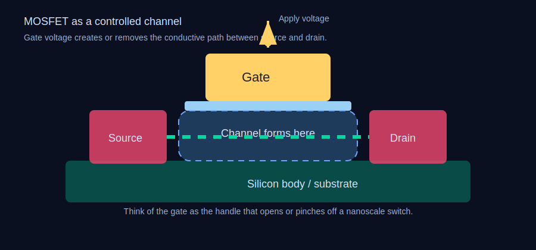

# Gün 1: Transistör Nedir?
## Vakum Tüplerinden MOSFET'lere — Düşünen Anahtarlar

Telefonunuzun, dizüstü bilgisayarınızın ya da arabanızın şimdiye dek yaptığı her hesap, temelde tek bir eyleme dayanır: küçücük bir elektrik anahtarını açıp kapamak. Bu anahtar **transistör**dür ve abartısız söylemek gerekirse, insanlık tarihinde en çok üretilen nesnedir. Yalnızca 2024 yılında yarı iletken endüstrisi kabaca **1,4 × 10²¹** transistör üretti — yani Dünya üzerindeki her insan için yaklaşık 175 trilyon. Başka bir ifadeyle: insanlık artık saniyede, yılda ürettiği pirinç tanesinden daha fazla transistör üretiyor.

Bu ders, transistörün vakum tüplerinden DNA ipliğinden bile küçük yapılara uzanan yolculuğunu izleyecek ve bu tek cihazın modern dünyayı neden mümkün kıldığını açıklayacak.

---

## Transistörden Önceki Sorun: Vakum Tüpleri

1940'larda "bilgi işlem" denince akla, cam vakum tüpleriyle dolu odalar gelirdi. Bunlar, uzatılmış ampullere benzeyen ve şaşırtıcı derecede basit bir ilkeyle çalışan cihazlardı. Bir metal filamenti, elektronların yüzeyinden kaynayıp kopacağı sıcaklığa kadar ısıtın (termiyonik emisyon), sonra filament ile plaka arasına yerleştirilmiş yüklü bir metal ızgara ile bu elektronların akıp akmayacağını kontrol edin. Izgara pozitif mi? Akım akar. Izgara negatif mi? Akım engellenir. Bir anahtar, hepsi bu.

1945'te tamamlanan **ENIAC**, **17.468** vakum tüpü kullanıyordu ve **150 kilovat** güç tüketiyordu — bu, yaklaşık 50 modern evi besleyecek kadardır. 15 metre uzunluğunda ve 9 metre genişliğinde bir odayı kaplıyor, 30 ton ağırlığında ve saniyede yaklaşık 5.000 toplama işlemi yapabiliyordu. Tüpler aşırı ısınmış ampuller gibi sürekli yanıp söndüğü için, arızalar arası ortalama süre yaklaşık 5,6 saatti. Teknisyenler, bilim insanlarının hesaplama yaptığından fazla zaman tüp değiştirmekle geçiriyordu.

Vakum tüplerinin üç ölümcül kusuru vardı:

1. **Isı.** Her tüp 1–2 vat ısı yayıyordu. Binlercesi bir arada olunca oda bir fırına dönüşüyordu.
2. **Boyut.** Tek bir tüp, başparmağınız kadardı. Milyonlarca tübe ölçeklenmek fiziksel olarak saçmaydı.
3. **Güvenilirlik.** Sıcak filamentler yaşlanır ve çatlar. Ne kadar çok tüp eklerseniz, bir şeylerin bozulma sıklığı o kadar artardı.

Dünyaya yanmayan, bozulmayan ve mikroskobik boyuta küçültülebilen bir anahtar gerekliydi. *Katı hal* bir anahtar — vakumsuz, filamentsiz, hareketli parçasız.

---

## 23 Aralık 1947: Nokta Temaslı Transistör

New Jersey, Murray Hill'deki Bell Laboratuvarları'nda fizikçiler **John Bardeen** ve **Walter Brattain**, **William Shockley**'nin teorik rehberliğinde ilk çalışan transistörü gösterdi. Kaba bir cihaz: üzerine iki altın nokta teması bastırılmış bir germanyum kristali parçası; temaslar arasında yaklaşık 50 mikrometre (aşağı yukarı bir insan saçının kalınlığı) vardı. Bir temasa küçük bir akım uygulandığında, diğerinden geçen daha büyük bir akımı kontrol edebiliyordu. Yükseltme — vakum tüplerinin yaptığı aynı numara, ama kurşun kalemin silgisinden biraz daha büyük bir kristal parçasıyla.

Üçlü, 1956 Nobel Fizik Ödülü'nü kazandı. Ama nokta temaslı transistör kaprisli ve üretimi zordu. Pratik olan Shockley'nin devam buluşu — 1948'de tanımlanan **bipolar bağlantılı transistör (BJT)** — oldu. Kırılgan nokta temasları yerine BJT, üst üste konmuş üç yarı iletken katman kullanıyordu: NPN veya PNP yapısı. İnce orta katmana (baz) akan akım, dış katmanlar (kolektör ve emitör) arasındaki çok daha büyük akımı kontrol ediyordu.

BJT'ler 1960'lar boyunca elektroniğe hükmetti ve analog devrelerde, RF yükselticilerde ve güç elektroniğinde hâlâ kullanılıyor. Ama dijital hesaplama dünyasında — birin ve sıfırın dünyasında — bambaşka bir transistör tipi çok daha önemli olacaktı.

---

## MOSFET: Dünyayı Yutan Transistör

1959'da, yine Bell Laboratuvarları'nda **Mohamed Atalla** ve **Dawon Kahng**, **Metal-Oksit-Yarı İletken Alan Etkili Transistör**ü, kısaca MOSFET'i icat etti. Buna 20. yüzyılın en önemli buluşu demek abartı olmaz. Bugün üretilen her işlemci, her bellek çipi, her GPU — 1980'lerden bu yana yapılan neredeyse tüm dijital entegre devreler — MOSFET'lerden oluşur.

İşte bir MOSFET böyle çalışır — ve bunu derinlemesine anlamak önemli, çünkü bu kursun geri kalanı tamamen bunun üzerine kuruludur.

### Yapı

Düz bir silikon levha hayal edin — diyelim ki **p-tipi** silikon, yani bor gibi atomlarla hafifçe kirletilmiş ("katkılanmış") ve pozitif yüklü "deşik" fazlalığı oluşturulmuş bir malzeme. Bu levhanın içine, fosfor veya arsenik ile katkılanarak negatif yüklü elektron fazlalığı oluşturulmuş iki küçük **n-tipi** silikon bölgesi yerleştirilir. Bu iki bölgeye **kaynak** (source) ve **akıtma** (drain) denir. Aralarında, orijinal p-tipi silikondan oluşan ince bir kanal bulunur.

Şimdi tam bu kanalın üzerine olağanüstü ince bir **silikon dioksit** (SiO₂) katmanı — cam gibi bir yalıtkan — biriktirin. Bu oksidin üzerine de iletken bir elektrot koyun: **kapı** (gate). İlk MOSFET'lerde bu kapı metalden yapılıyordu (bu yüzden "Metal-Oksit-Yarı İletken"), ama modern transistörler polisilikon veya metal alaşımları kullanır.

Kapı, kanalın hemen üzerinde durur ama oksit katmanıyla ondan elektriksel olarak yalıtılmıştır. Bu çok kritik bir detaydır.

### Sihir: Alan Etkisi

Kapıya voltaj uygulanmadığında, kaynaktan akıtmaya akım akmaz. Neden? Çünkü aralarındaki p-tipi kanal, arka arkaya bağlanmış iki diyot gibi davranır — n-tipi kaynaktan gelen elektronlar p-tipi silikon duvarına çarpar ve durur. Anahtar **kapalıdır**.

Şimdi kapıya pozitif bir voltaj uygulayın. Kapıdan gelen elektrik alan, ince oksit tabakasını geçerek altındaki silikona nüfuz eder. Bu alan, p-tipi kanaldaki delikleri iter ve kaynak ile akıtma bölgelerinden elektronları çeker. Voltaj yeterince yüksekse (**eşik voltajı** — modern çiplerde genellikle 0,2–0,7 volt), kanal yüzeyinde ince bir elektron tabakası birikir ve kanal fiilen p-tipinden n-tipine dönüşür. Artık kaynaktan akıtmaya kesintisiz bir n-tipi yol vardır. Akım akar. Anahtar **açıktır**.

Kapı voltajını kaldırın, elektronlar dağılır, kanal yeniden p-tipine döner. Anahtar kapanır.

İşte alan etkisi budur: kapıdaki voltaj, *kapıdan herhangi bir akım geçmeden* kanaldaki akımı kontrol eder. Kapı yalıtılmıştır. Bir su vanasını vanaya dokunmadan, yanında bir mıknatıs sallayarak kontrol etmek gibi — temassız etki. Kapıdan neredeyse sıfır akım geçmesi, MOSFET'lerin BJT'lere kıyasla çok daha enerji verimli olmasının nedenidir (BJT'lerde bazdan her zaman bir miktar akım geçer).

### MOSFET Neden Kazandı

Üç özellik MOSFET'i kral yaptı:

1. **Ölçeklenebilirlik.** Bir MOSFET temelde düz, düzlemsel bir yapıdır — kaynak, akıtma, kapı, oksit. Fotoğrafik olarak küçültülebilir. Deseni küçültün, transistör küçülür. Bu, 4. Günde ele alacağımız Moore Yasası'nın temelidir.

2. **Düşük statik güç tüketimi.** Kapı yalıtılmış olduğundan, "kapalı" durumdaki bir MOSFET neredeyse hiç akım çekmez (pratikte çok küçük bir kaçak akım vardır ama ihmal edilebilir düzeydedir). BJT'nin bazı ise sürekli bir miktar akım sızdırır. *Milyarlarca* transistörünüz olduğunda bu fark muazzam önem kazanır.

3. **CMOS: Tamamlayıcı Hile.** 1963'te Fairchild Semiconductor'dan Frank Wanlass, bir NMOS transistörü (p-tipi alt tabanda n-tipi kanal) bir PMOS transistörle (n-tipi alt tabanda p-tipi kanal) itme-çekme düzeninde eşleştiren **Tamamlayıcı MOS (CMOS)** tasarımının patentini aldı. Bir CMOS kapısında her zaman bir transistör kapalıyken diğeri açıktır; bu da akımın yalnızca anahtarlama sırasında aktığı anlamına gelir — sabit durumda değil. Bu, statik güç tüketimini neredeyse sıfıra düşürdü ve telefonunuzun pilinin milyarlarca transistör içermesine rağmen gün boyu dayanmasının *asıl* nedenidir.

---

## Anahtardan Mantığa: Transistörler Nasıl Hesaplar

Tek bir transistör sadece bir anahtardır: açık ya da kapalı, 1 ya da 0. Ama birkaç transistörü birleştirdiğinizde **mantık kapıları** elde edersiniz — Boole işlemleri gerçekleştiren devreler.

En basit örneği ele alalım: bir **CMOS eviricisi** (NOT kapısı). Üste bir PMOS, alta bir NMOS transistör koyun, kapılarını girişe bağlayın, çıkışı aralarındaki birleşim noktasından alın. Giriş yüksek (1)? NMOS açılır, PMOS kapanır, çıkış düşük (0) olur. Giriş düşük (0)? PMOS açılır, NMOS kapanır, çıkış yüksek (1) olur. İki transistör, bir tersine çevirme.

Bir **NAND kapısı** — yalnızca *iki* giriş de 1 olduğunda 0 çıktısı veren kapı — CMOS'ta sadece dört transistör gerektirir: seri bağlı iki NMOS ve paralel bağlı iki PMOS. NAND "işlevsel olarak eksiksizdir", yani yalnızca NAND kapılarından *herhangi bir* Boole fonksiyonunu kurabilirsiniz. Teoride, sadece NAND kapılarıyla komple bir işlemci inşa edebilirsiniz (pratikte de standart hücre kütüphaneleri büyük ölçüde NAND tabanlıdır).

Mantık kapılarını ve bunların işlemcilere nasıl dönüştüğünü 5. Günde derinlemesine inceleyeceğiz. Şimdilik temel çıkarım şu: **karmaşık hesaplama, saniyede milyarlarca kez açılıp kapanan, koreografik düzende çalışan milyarlarca basit anahtardan ibarettir.**

---

## Ne Kadar Küçük Diyoruz?

Atalla ve Kahng'ın 1959 MOSFET'indeki transistörlerin kapı uzunlukları **milimetre** mertebesindeydi. 1971'de Intel'in 4004'ü — ilk ticari mikroişlemci — **10 mikrometre** (10.000 nanometre) kapı uzunluğuyla 2.300 transistör barındırıyordu. Her transistör yaklaşık bir kırmızı kan hücresinin genişliğindeydi.

2024'e hızlı geçiş. Apple'ın M4 işlemcisi, TSMC'nin "3nm" üretim sürecinde (N3E) üretilir ve yaklaşık **28 milyar transistör** içerir. Gerçek kapı uzunluğu yaklaşık **12 nanometre** — 3nm değil, bunu 6. Günde açıklayacağız. Ölçek için: bir silikon atomunun çapı yaklaşık 0,2 nanometredir. Bu transistörlerdeki kapı oksidi yaklaşık **1,2 nanometre** kalınlığındadır — sadece 5 atom üst üste.

İşte sezgilere aykırı kısım: **transistör anahtarı o kadar küçülmüştür ki artık kuantum mekanik etkileri devreye girer.** Elektronlar, kapı oksidi çok ince olduğunda içinden "tünelleyebilir" — bir topun duvarı aşmak yerine duvarın içinden geçmesi gibi. Yaklaşık 1,5 nanometrenin altındaki SiO₂ kalınlıklarında tünelleme kaçağı felaket boyutlarına ulaşır. Bu nedenle 2007 civarında 45nm düğümden itibaren endüstri, SiO₂ yerine **yüksek-k dielektrikler** kullanmaya başladı — hafniyum dioksit (HfO₂) gibi malzemeler, fiziksel olarak daha kalın bir katmanda aynı kapasitif bağlantıyı sağlayarak kuantum canavarlarını uzak tutar. Intel'in Gordon Moore ve meslektaşları bunu on yıllar öncesinden öngörmüştü; çözmek, malzeme biliminin büyük başarılarından biri oldu.

---

## Bir Transistörün Şaşırtıcı Ekonomisi

İşte sizi durdurup düşündürecek bir sayı: TSMC'nin N3 sürecindeki tek bir transistör yaklaşık **0,000000005 dolar** — beş milyarda bir dolar — maliyetindedir. Transistörler, birim başına yeryüzündeki en ucuz üretilmiş nesnelerdir. Pirinç tanelerinden ucuz. Tek bir bakteri boyutundaki mürekkep damlasından bile ucuz.

Ama bu ucuzluk yanıltıcıdır. Bu transistörleri üreten *fabrika* — TSMC'nin Tainan, Tayvan'daki Fab 18 tesisi — inşa etmek için **19,5 milyar doların** üzerinde harcandı. İçindeki litografi makineleri, Hollanda ASML tarafından üretilir, her birinin fiyatı **380 milyon dolar** ve nakliye için üç adet Boeing 747 kargo uçağı gerekir. Her biri 100.000'den fazla bileşen içerir; bunlardan biri saniyede 50.000 erimiş kalay damlacığını ateşleyerek aşırı morötesi ışık üreten bir lazer sistemidir.

Transistör ucuzdur çünkü kavranamayacak kadar çok üretilir. Sabit maliyetler devasa, marjinal maliyet neredeyse sıfırdır. Bu ekonomik yapı — muazzam sermaye harcamasının milyarlarca birime bölünmesi — tüm yarı iletken endüstrisini tanımlar ve en ileri teknolojiyle üretim yapabilecek yalnızca üç şirketin (TSMC, Samsung, Intel) kalmasını açıklar. Bununla ilgili daha fazla bilgi 27. Günde.

---

## Transistörlerin Geleceği

Klasik düzlemsel MOSFET — düz bir kanal üzerinde oturan düz bir kapı — 2011 civarında ölçekleme sınırlarına ulaştı. 22nm düğümde Intel, kanalın bir yüzgeç gibi dikey olarak çıkıp kapının onu üç tarafından sardığı **FinFET** transistörleri tanıttı. Bu, kapıya kanal üzerinde daha iyi kontrol sağlayarak kaçağı azaltır ve daha fazla küçülme imkânı sunar. O zamandan beri en ileri her çip FinFET kullanıyor.

Ama FinFET'ler de kendi sınırlarına yaklaşıyor. 2025'ten itibaren Samsung ve TSMC, kanalın ince silikon nano-levhalar (nanosheet) yığınından oluştuğu ve kapının kanalı dört taraftan tamamen sardığı **Kapı-Her-Taraftan (GAA — Gate-All-Around)** transistörleri devreye alıyor. Samsung kendininkine "MBCFET" (Multi-Bridge Channel FET) diyor; TSMC ve Intel ise "nanosheet" adı altında varyasyonlar kullanıyor. GAA transistörler, 2nm nesli ve sonrasına güç verecek.

Daha ilerisinde araştırmacılar, tek bir atom katmanına — yaklaşık 0,7 nanometre kalınlığa — incelebilen **molibden disülfür (MoS₂)** gibi **2D kanal malzemelerini** araştırıyor; bu, silikonun ulaşabileceğinden çok daha ince kanallar sağlayabilir. MIT'de **Tomás Palacios** liderliğindeki laboratuvarlar, 2D kanallı çalışan transistörler gösterdi. Seri üretim için henüz o noktada değiliz, ama yol haritası mevcut.

---

## Temel Çıkarımlar

- **Transistör, elektrikle kontrol edilen bir anahtardır.** Kapı voltajı, kaynak ile akıtma arasındaki akımı kontrol eder. Mekanik parça yok.
- **MOSFET baskın çünkü** güzelce ölçeklenir, neredeyse sıfır statik güç tüketir (özellikle CMOS'ta) ve fotoğrafik olarak üretilebilir.
- **Kapı oksidi kahramandır.** Kapı ile kanal arasındaki o ince yalıtkan katman, alan etkili kontrolü mümkün kılar — ve içinden kuantum tünellemesi, mühendislerin uykularını kaçıran şeydir.
- **Transistörler şimdiye kadar seri üretilmiş en ucuz nesnelerdir**, ama onları üreten fabrikalar şimdiye kadar inşa edilmiş en pahalı yapılardır. Bu paradoks tüm endüstriyi şekillendirir.
- **65 yılda milimetre ölçeğinden atom ölçeğine geçtik.** Bir sonraki sınır — GAA, 2D malzemeler — "kaç atom genişliğinde?" sorusunun gerçek bir mühendislik sorusu olduğu bölgeye doğru ilerliyor.

---

## Yarın

Eğer transistörler tuğlalar ise, silikon plakalar onların üzerine inşa edilen temeldir. Peki bu silikon nereden geliyor? Yarın, **sıradan kumdan insanoğlunun şimdiye kadar ürettiği en kimyasal olarak saf malzemeye** uzanan yolculuğu izleyeceğiz — öyle kusursuz bir kristal ki, Dünya boyutuna büyütseniz en büyük safsızlık bir tenis topundan küçük olurdu. Süreç 1.400°C üzeri sıcaklıklar, asit banyoları ve 19. yüzyıl mineralojisinden ödünç alınan bir kristal büyütme tekniğini içerir. 2. Günde görüşmek üzere.

---

{{#quiz quizzes/gun-01.toml}}
