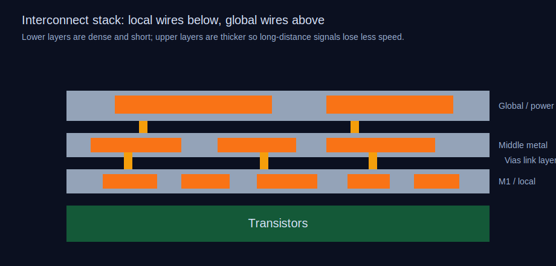

# Gün 11: Ara Bağlantılar
## Milyarlarca Transistörü Birbirine Bağlayan Bakır Otoyol

Dün silikona elektriksel kişiliğini nasıl kazandıracağımızı öğrendik — transistörleri çalıştıran p-n eklemlerini oluşturmak için hassas dozlarda katkı atomlarını implante edip tavlayarak yerine yerleştirdik. Ama işte çoğu çip anlatıcısının üzerinden geçtiği rahatsız edici bir gerçek: **artık darboğaz transistörlerin kendisi değil. Teller.**

Modern bir işlemci — diyelim Apple'ın 37 milyar transistörlü M3 Pro'su — yaklaşık **130 kilometre** kablolama içerir. Mecazi değil. Gerçek anlamda bir virüsten daha ince, silikon yüzeyinin üzerinde 13 ila 15 katmanda yığılmış yüzden fazla kilometre bakır iz; Manhattan'ın sokak ızgarasını bir köy yoluna benzeten karmaşık üç boyutlu bir otoyol sistemi. Transistörler hesaplamanın motorlarıysa, ara bağlantılar onların birbirleriyle konuşmasını sağlayan yollar, üst geçitler ve köprülerdir. Ve tıpkı gerçek bir şehirdeki gibi, **hızı belirleyen motorlar değil, trafiktir.**

Bu, arka uç hat (BEOL) işlemenin hikayesidir: çip üreticilerinin milyarlarca transistörün üzerine bakır otoyolları nasıl inşa ettiği, alüminyumun neden neredeyse gerçekleşmeyecek bir devrimde bakıra yerini bıraktığı ve ara bağlantı sorununun neden artık yarı iletken ölçeklemenin en büyük baş ağrısı olduğu.

## RC gecikmesinin tiranlığı

Ara bağlantıların neden bu kadar önemli olduğunu anlamak için tek bir denkleme ihtiyacınız var. Bir tel sadece bir iletken değildir — akım akışına karşı koyan **direnci** (R) ve komşu tellerine ve alttaki alt tabakaya **kapasitansı** (C) vardır. Bir tel boyunca sinyal gecikmesi R × C ile orantılıdır ve boyutları küçülttükçe ikisi de kötüleşir.

Direnç basittir: R = ρL/A, burada ρ metalin özdirenci, L telin uzunluğu ve A kesit alanıdır. Telin genişliğini ve yüksekliğini yarıya indirin ve A'yı 4 kat azaltarak direnci dört katına çıkarmış olursunuz. Kapasitans daha karmaşıktır — komşu teller arasındaki mesafeye ve aralarındaki yalıtkan malzemenin dielektrik sabitine bağlıdır. Telleri birbirine yaklaştırın (transistörler küçüldükçe zorundasınız) ve kapasitans artar.

İşte sezgiye aykırı kısım. CMOS ölçeklemenin ilk on yıllarında **kapı gecikmesi** — bir transistörün anahtarlama süresi — toplam çip gecikmesine hakimdi. Ara bağlantı gecikmesi yuvarlama hatasıydı. Ama kapı gecikmesi ölçeklemeyle iyileşir (daha küçük transistörler daha hızlı anahtarlar), ara bağlantı gecikmesi ise kötüleşir. Kesişim **1990'ların sonunda 250 nm düğümünde** gerçekleşti. O zamandan beri ara bağlantı sınırlı çağda yaşıyoruz. 7 nm düğümünde yerel ara bağlantı gecikmesi kabaca **kapı gecikmesinin 10 katıdır**. 3 nm'de daha da kötü.

Bu yüzden Intel, TSMC ve Samsung toplu olarak BEOL'a sürecin herhangi bir parçasından daha fazla mühendislik saati harcar. Ve bu yüzden 1997'de IBM, yarı iletken endüstrisinin imkansız ilan ettiği bir şeyi yaptı.

## Bakır devrimi

Entegre devrelerin ilk 30 yılında kablolama **alüminyum**du. Alüminyum makul düzeyde iletkendir (özdirenç ~2,7 μΩ·cm), sıçratmayla biriktirilmesi kolaydır ve desenlenmesi basittir — klor bazlı plazmayla aşındırabilirsiniz. BEOL süreci birikir-desenle-aşındır şeklindeydi: bir kat alüminyum serin, tel desenini fotoreziste yazdırın, istemediğinizi aşındırarak kaldırın, boşlukları yalıtkan oksitle doldurun. Basit.

Ama 1990'ların ortalarında alüminyum duvara çarptı. Teller 350 nm'nin altına indikçe iki sorun kritik hale geldi. İlki, RC gecikmesi fazla yüksekti — alüminyumun özdirenci çok büyüktü. İkincisi, alüminyum **elektromigrasyon**dan muzdaripti: küçük tellerin gerektirdiği akım yoğunluklarında "elektron rüzgarı" kelimenin tam anlamıyla alüminyum atomlarını tel boyunca iterek sonunda bağlantıyı koparan boşluklar oluşturuyordu. 180 nm'de bir alüminyum tel sadece birkaç yıllık çalışmadan sonra arızalanabilirdi.

Bakır bariz cevaptı. Toplu özdirenci **1,7 μΩ·cm** — alüminyumdan yaklaşık %37 daha düşük. Ayrıca eşdeğer akım yoğunluklarında kabaca **25 kat daha iyi elektromigrasyon direncine** sahiptir. Kağıt üzerinde bakır, gecikme sorununu ve güvenilirlik sorununu aynı anda çözebilirdi.

Sorun mu? **Bakır aşındırılamaz.** Bunu sindirelim. Standart yarı iletken süreci — metal birikir, desenle, aşındır — işe yaramaz. Bakır, makul sıcaklıklarda hiçbir plazma kimyasıyla uçucu bileşikler oluşturmaz. Bakırı klor plazmasıyla aşındırmaya çalıştığınızda bakır klorür elde edersiniz — orada duran ve dokunduğu her şeyi zehirleyen katı bir kalıntı. Bu tek malzeme özelliği bakır ara bağlantıları on yıldan fazla engelledi. Herkes bakırın daha iyi olduğunu biliyordu; kimse onu nasıl desenlendireceğini çözemiyordu.

IBM'in Eylül 1997'de duyurulan ve 220 nm düğümünde üretime alınan buluşu **şam işlemi**ydi — adını Şam'ın kılıç ustaları tarafından uygulanan, bir metali diğerine kakma şeklindeki antik metal işleme tekniğinden alır. Kavrayış zarifti: metali biriktirip sonra istemediğini kaldırmak yerine, **önce yalıtkanı kaldır, sonra hendekleri metalle doldur**.

## Şam işlemi: nehirler oyup bakırla doldurmak

Çift şam işlemi — 1998'den beri her öncü fab tarafından kullanılan — birbirini güzelce tamamlayan birkaç adımda çalışır.

**Adım 1: Dielektrik biriktirme.** Bir yalıtkan malzeme katmanı biriktirirsiniz — geleneksel olarak silisyum dioksit (SiO₂), artık giderek daha fazla SiO₂'nin κ'sı ~3,9'a kıyasla 2,5-3,0 civarında κ değerine sahip SiCOH gibi düşük-κ (düşük dielektrik sabiti) malzemeler. κ ne kadar düşükse, komşu teller arasındaki kapasitans o kadar düşük ve sinyaller o kadar hızlı yayılır. κ'yı 2,5'in altına düşürmek gözeneklilik gerektirir — kelimenin tam anlamıyla yalıtkanı küçük hava cepçikleriyle dolu yapmak — bu da onu mekanik olarak kırılgan kılar. 3 nm düğümünde bazı katmanlar κ'sı 2,0-2,2 civarında olan ultra düşük-κ dielektrikler kullanır ve bunların işleme sırasında çatlamamasını sağlamak sürekli bir mücadeledir.

**Adım 2: Hendek ve via desenleme.** Fotoligotografi ve reaktif iyon aşındırma (3. ve 9. Günlerde ele aldığımız teknikler) kullanarak teller için hendekler ve bir metal katmanı diğerine bağlayan dikey delikler (vialar) oyarsınız. "Çift şam" yönteminde, hem hendek hem de via, metal dolgudan önce aynı dielektrik katmana desenlenir ve böylece işlem adımı sayısı azalır. Buradaki en-boy oranları ağırdır — 3 nm düğümünde bir via 20 nm genişliğinde ve 100 nm derinliğinde olabilir, hiçbir boşluk bırakmadan doldurulması gereken 5:1'lik bir en-boy oranı.

**Adım 3: Bariyer ve tohum katmanları.** İşte bakıra özgü bir sorun: bakır, **silisyum dioksit boyunca hızla yayılır.** Bakırın en ufak bir izi alttaki transistör bölgesine göç ederse, silikon bant aralığında transistörü öldüren derin seviye tuzaklar oluşturur. Bakır kirlenmesi o kadar yıkıcıdır ki fablarda ön uç işleme için özel "bakırsız" bölgeler vardır ve bakır görmüş herhangi bir plaka ön uç araçlara girmekten kalıcı olarak men edilir.

Bakırı tutmak için önce ultra ince bir **bariyer katmanı** — tipik olarak yaklaşık 1-3 nm kalınlığında tantal (Ta) ve tantal nitrür (TaN) — biriktirirsiniz; bu, yapışma sağlarken bakır difüzyonunu önler. Bu, fiziksel buhar biriktirme (PVD) ile, özellikle hendek yan duvarlarını konformal olarak kaplayabilen iyonize metal plazma sıçratma yöntemiyle yapılır. Ardından bariyerin üstüne PVD ile ince bir **bakır tohum katmanı** (10-20 nm) biriktirirsiniz; bu, bir sonraki adım için elektrot görevi görecektir.

**Adım 4: Elektrokaplama.** İnsanları şaşırtan kısım budur. Tüm egzotik plazma fiziği ve atomik katman mühendisliğinden sonra, bakır hendeklerini esasen bir araba tamponunu krom kaplamayla aynı kimya kullanarak — **elektrokimyasal biriktirme** — doldurursunuz. Bakır tohum katmanı katot görevi gören plaka, bakır sülfat (CuSO₄) ve sülfürik asit (H₂SO₄) içeren bir elektrolit banyosuna daldırılır. Akım uygulayın ve bakır iyonları yüzeye indirgenir.

Ama bu büyükbabanızın elektrokaplaması değildir. Banyo üç kritik organik katkı maddesi içerir — bir **hızlandırıcı** (tipik olarak SPS, bis(3-sülfopropil) disülfür), bir **baskılayıcı** (polietilen glikol, PEG) ve bir **düzleştirici** (Janus Green B gibi amin bazlı bir bileşik). Bu katkılar **süper doldurma** veya **alttan yukarı doldurma** adı verilen dikkat çekici bir etki yaratır: bakır hendeğin üstünden çok tabanında daha hızlı birikir, ortada bir dikiş veya boşluk bırakmadan alttan yukarı doldurur. Bu katkılar olmasaydı, bakır açıktaki üst kenarlarda (akım yoğunluğunun en yüksek olduğu yerde) daha hızlı birikir, hendek açıklığını tıkayıp içeride bir boşluk hapsederdi — ölümcül bir kusur.

Mekanizma gerçekten zekicedir. Baskılayıcı her yere adsorbe olur ve biriktirmeyi yavaşlatır. Hızlandırıcı, hendek tabanında yoğunlaşır (başlangıçtaki konformal büyüme aşamasındaki geometrik etkiler nedeniyle) ve baskılayıcıyı yerel olarak geçersiz kılarak orada biriktirmeyi hızlandırır. Hendek doldukça ve taban yüzey alanı küçüldükçe, hızlandırıcı konsantrasyonu daha da artar ve alttan yukarı doldurmayı hızlandıran pozitif bir geri besleme döngüsü yaratır. Düzleştirici, yüksek noktalarda biriktirmeyi seçici olarak durdurarak tümsek oluşumunu önler. Bu üç katkının etkileşimi — geometri tarafından yönlendirilen rekabetçi bir adsorpsiyon sistemi — yarı iletken üretimindeki en zarif uygulamalı kimya parçalarından biridir.

**Adım 5: Kimyasal Mekanik Düzleştirme (CMP).** Elektrokaplama kaçınılmaz olarak hendekleri fazla doldurur ve plaka yüzeyinde fazla bakır ("yük fazlası" olarak adlandırılır) bırakır. Telleri yalıtmak ve bir sonraki katman için düz bir yüzey oluşturmak amacıyla bunun kaldırılması gerekir. CMP — yarın derinlemesine inceleyeceğimiz — plakayı hendeklerin içinde yalnızca bakır kalana kadar aşındırır ve parlatır, bir sonraki dielektrik biriktirme için mükemmel düz bir yüzey bırakır.

Tüm bu döngüyü 13 ila 15 kez tekrarlayın ve modern bir işlemcinin tam ara bağlantı yığınını elde edersiniz.

## Metal katman hiyerarşisi: bir şehrin yol sistemi

Tüm metal katmanlar eşit yaratılmamıştır. Modern bir çipin ara bağlantı yığını dikkatle planlanmış bir hiyerarşidir ve bir şehrin ulaşım sistemine benzetme neredeyse tam tutulur.

**Yerel ara bağlantılar (M1-M2)** en dar olanlardır — 3 nm düğümünde bu teller sadece **20-24 nm genişliğinde** ve 20-28 nm adımındadır. Yakın transistörleri birbirine bağlarlar: bir kapının çıkışını bir sonrakinin girişine, komşu evleri birbirine bağlayan ara sokaklar gibi. Kısa oldukları için (en fazla birkaç mikrometre) mutlak RC gecikmeleri küçük boyutlara rağmen mütevazıdır.

**Ara ara bağlantılar (M3-M8 civarı)** kademeli olarak daha geniş ve daha yüksektir, orta mesafe iletişimi sağlar. Bunları bulvarlar ve caddeler olarak düşünün — daha uzun mesafelerde daha fazla trafik taşırlar. 3 nm düğümünde ara teller 40-80 nm genişliğinde olabilir.

**Küresel ara bağlantılar (M9-M15)** en kalın olanlardır — **1-3 μm genişliğe** ve birkaç yüz nanometre yüksekliğe kadar. Bunlar, saat sinyallerini ve gücü tüm çip boyunca taşıyan otoyollardır. Modern bir işlemcideki bir saat sinyali 5-10 mm (bu ölçekte bir sonsuzluk) kat edebilir ve çok fazla gecikme veya sinyal bozulması olmadan ulaşmak için kalın, düşük dirençli bir tele ihtiyaç duyar.

**Güç dağıtımı (üst katmanlar)** kendi başına bir zorluktur. NVIDIA'nın Blackwell B200'ü gibi modern bir GPU **1.000 watt**'ın üzerinde güç harcar ve her watt, ara bağlantı yığınından aşağıdaki transistörlere iletilmelidir. Bu, **10⁶ A/cm²**'ye yaklaşan akım yoğunluklarında metal izler boyunca yüzlerce amper taşımak anlamına gelir — bakır için bile elektromigrasyon sınırına yakın. Intel'in "PowerVia" teknolojisi (Intel 20A düğümünde ilk kullanım) güç dağıtım ağını plakanın **arka tarafına** taşıyarak sinyal kablolarından tamamen ayırır. Bu, sinyal yönlendirme kaynaklarını serbest bırakır ve akım dirençli metalden akarken kaybedilen gerilim olan IR düşüşünü %30 veya daha fazla azaltır.

## Bakırın krizi: özdirenç duvarı

İşte BEOL mühendislerini geceleri uyanık tutan kısım. Toplu bakırın özdirenci 1,7 μΩ·cm'dir. Harika. Ama 20 nm genişliğinde bir bakır tel toplu bakır gibi davranmaz. Etkin özdirenci **3-5 kat daha yüksek**, yaklaşık 5-8 μΩ·cm'dir ve her düğümde kötüleşir.

Üç fizik olgusu aleyhinize birleşir:

**Tane sınırı saçılması.** Elektrokaplama ile biriktirilen bakır polikristaldir — sınırlarla ayrılmış küçük kristal tanelerden oluşur. Bir tane, tel genişliğiyle karşılaştırılabilir boyutta olduğunda (20 nm'de kaçınılmaz olarak öyledir), elektronlar sınırlardan sık sık saçılır ve direnci artırır. Biriktirmeden sonra bakırı 300-400°C'de tavlamak taneleri büyütür ve yardımcı olur, ama sınırları tamamen ortadan kaldıramazsınız.

**Yüzey saçılması.** Bakır ile bariyer/kaplama katmanları arasındaki pürüzlü arayüzlerden seken elektronlar momentumlarını kaybeder. Tel küçüldükçe bakır hacminin daha büyük bir kısmı "bir yüzeye yakın" olur ve bu etki baskın hale gelir. Fuchs-Sondheimer modeli, yüzey saçılmasının 1/genişlikle orantılı direnç eklediğini öngörür, yani tel genişliğini her yarıya indirdiğinizde **ikiye katlanır**.

**Bariyer yükü.** Her yan duvardaki 1-3 nm TaN/Ta bariyer katmanı iyi iletmez. 20 nm genişliğinde bir hendekte bariyer, toplam kesitin %10-30'unu kaplar ve bakıra daha az yer bırakır. Tel boyutlarını aynı tutarken iletkeni fiilen daraltıyorsunuz. Daha ince bariyerler geliştirme çabaları — veya metal-üzerine-metal seçici biriktirme kullanan bariyersiz yaklaşımlar — önemli bir araştırma alanıdır.

Birleşik sonuç: 2 nm düğümü ve ötesinin en dar adımlarında bakırın etkin özdirenci, ara bağlantılardan kaynaklanan RC gecikme cezasının daha küçük transistörlerden gelen hız iyileştirmesini **tamamen ortadan kaldırma** tehdidinde bulunduğu noktaya yaklaşıyor. Transistörler hızlanıyor ama onları birbirine bağlayan teller daha da hızlı yavaşlıyor.

## Bakırın ötesinde: rutenyum, kobalt ve sonrası arayışı

Yaklaşan bakır krizi endüstriyi alternatiflere koşturdu. En dar ara bağlantı katmanları için iki metal önde gelen aday olarak öne çıktı:

**Kobalt (Co)**, Intel tarafından 10 nm düğümünde (2018) yerel ara bağlantılar için tanıtıldı. Kobaltın toplu özdirenci (6,2 μΩ·cm) aslında bakırınkinden daha kötüdür ve bu ters üretken gibi görünür. Ama kobalt, kalın bir bariyer katmanı olmadan CVD ile konformal olarak biriktirilebilir — doğal olarak dielektriklere yapışır ve bakır kadar agresif yayılmaz. ~15 nm'nin altındaki tel genişliklerinde kobaltın daha ince astar gereksinimleri, toplu değeri 3,6 kat daha kötü olmasına rağmen *etkin* özdirencinin bakırınkini gerçekten geçtiği anlamına gelir. Bu kesişim — teorik olarak daha kötü malzemenin geometri nedeniyle pratikte kazandığı yer — nano ölçek fiziğinin makroskopik sezgiyi nasıl altüst ettiğinin güzel bir örneğidir.

**Rutenyum (Ru)** ara bağlantı araştırmasının şu anki gözdesidir. Toplu özdirenç 7,1 μΩ·cm — kobalttan bile yüksek — ama rutenyumun dikkat çekici bir özelliği var: elektron ortalama serbest yolu bakırın **39 nm**'sine kıyasla sadece yaklaşık **6,7 nm**dir. Daha kısa ortalama serbest yol, elektronların zaten toplu halde sık saçıldığı anlamına gelir, dolayısıyla yüzeylerden ve tane sınırlarından gelen *ek* saçılmanın göreceli etkisi daha azdır. Rutenyumun özdirenci teli küçülttükçe neredeyse artmazken, bakırınki patlar. Belçika araştırma konsorsiyumu Imec, 10 nm tel genişliğinde bakırdan **%40 daha düşük** etkin özdirenç gösteren rutenyum ara bağlantıları göstermiştir. TSMC ve Samsung, 2 nm ve altı için rutenyumu değerlendiriyor.

Ufukta daha egzotik seçenekler de var: **grafen kaplı bakır** (bakır yüzeyindeki tek katman grafenin yüzey saçılmasını azalttığı), bizmut ve antimon gibi **yarı metaller** (çok kısa ortalama serbest yolu ve ince filmlerde yüksek iletkenliği olan) ve uzun vadeli hayali **optik ara bağlantılar** — çip ölçeğinde iletişim için elektronları fotonlarla değiştirmek. Intel, TSMC ve Ayar Labs gibi girişimler çipten çipe iletişim için silikon fotonikleri göstermiş, ancak çip içi optik ara bağlantılar araştırma projesi olarak kalmaya devam ediyor.

## Modern BEOL'u tanımlayan sayılar

Mühendislik zorluğunu takdir etmek için öncü 3 nm sürecinden bazı gerçek sayılara bakalım:

- **Metal katmanlar:** 13-15
- **Çip başına toplam tel uzunluğu:** 50-130 km
- **Minimum metal adımı (M1):** 20-28 nm
- **M1'de en-boy oranı (yükseklik:genişlik):** 2:1 ila 2,5:1
- **Bariyer kalınlığı:** 1-2 nm TaN/Ta
- **Bakır tohum katmanı:** 10-15 nm
- **Düşük-κ dielektrik sabiti:** 2,0-2,7 (katmana göre değişir)
- **CMP adımları:** Çip başına 20-30 (her metal katmana bir veya daha fazla)
- **Elektrokaplama banyosu sıcaklığı:** 25°C (oda sıcaklığı)
- **Bakır tane tavlaması:** 300-400°C, 30-60 dakika
- **Via direnci (tek via):** M1'de 10-50 ohm
- **M1'de akım yoğunluğu:** ~5 × 10⁶ A/cm²
- **BEOL işleme süresi:** Toplam plaka işleme süresinin ~%40'ı

Son rakam çarpıcıdır. Transistörler — çipin "beyni" — ön uç hat (FEOL) işleme sırasında inşa edilir ve toplam sürenin yaklaşık %30-35'ini alır. Ara bağlantılar — "tesisat" — %40 veya daha fazlasını alır. Telleri yapmak transistörlerden daha zordur.

## Paket yetişiyor (bir ipucu)

İşte bir düşünce deneyi. Çipinizde 37 milyar transistör 130 km telle bağlıysa, alt katmanlardaki teller 20 nm genişliğinde ve üst katmanlardakiler 3 μm genişliğindeyse, dikkat çekici bir çok ölçekli altyapı inşa etmişsinizdir. Ama hepsi kalıbın kenarında son bulur. Çipten ayrılan sinyaller pakete ulaşmak için bir boşluğu aşmalı, ardından karta ulaşmak için milimetre ölçeğinde paket kablolarından geçmelidir.

Bu geçiş — nanometre ölçekli çip içi tellerden mikrometre ölçekli paket tellerine — giderek daha hantal hale geliyor. Çip, dış dünyayla iletişim kurabileceğinden daha hızlı hesap yapabiliyor. Bu, sinyalleri mümkün olduğunca uzun süre ince adım rejiminde tutmaya çalışan **çiplet'ler, 3D istifleme, hibrit bağlama ve silikon ara yüzeyler** ile tüm bir paketleme devrimini yönlendiriyor.

Ama 13. Gün'de paketlemeye geçmeden önce, anlamamız gereken bir kritik BEOL adımı daha var: şam işlemini mümkün kılan süreç — **Kimyasal Mekanik Düzleştirme**. Yarın, yarı iletken endüstrisinin plakaları atom atom nasıl parlatarak angström cinsinden ölçülen düzlüğe ulaştığını ve bu görünüşte kaba sürecin (kelimenin tam anlamıyla zımpara ile taşlama) fabtaki en sofistike ve en az anlaşılmış adımlardan biri olduğunu keşfedeceğiz.

---

**Bilginizi test etmeye hazır mısınız?**

{{#quiz quizzes/gun-11.toml}}
